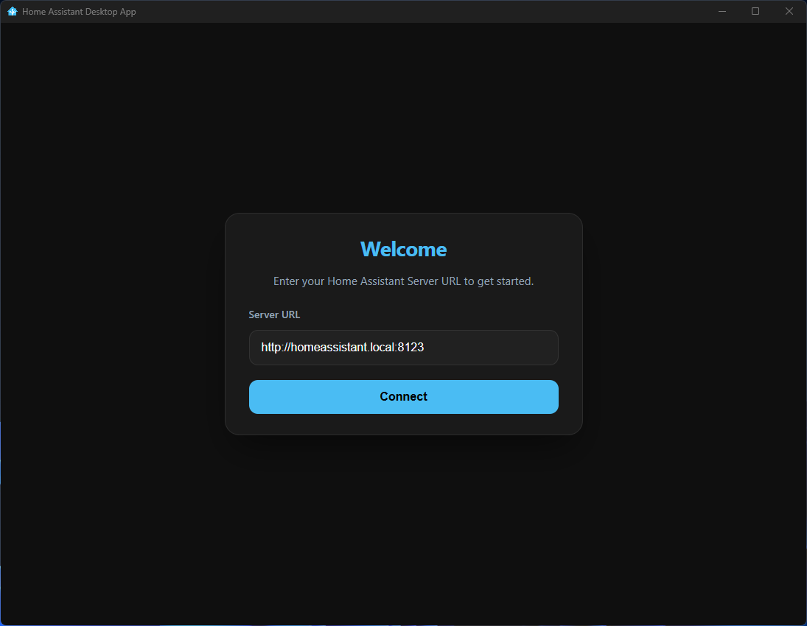
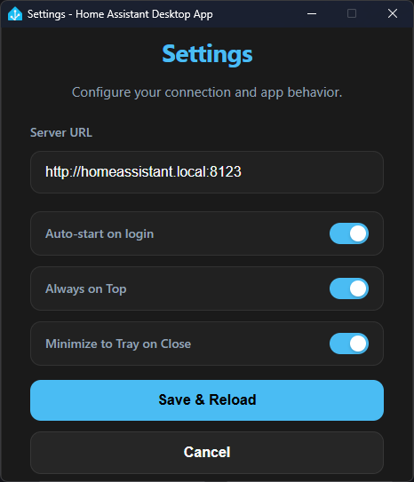

# 🏠 Home Assistant Desktop App

[](https://www.electronjs.org/)
[](#performance-optimizations)
[](#)

A powerful, lightweight, and dedicated desktop wrapper for your **Home Assistant** server. Built with Electron, this application is designed to provide a native-like experience for your smart home dashboard with a heavy focus on performance, low resource usage, and seamless CCTV streaming.

---

## ✨ Features

*   **🚀 Extreme Optimization**: Tailored for low RAM (128MB ceiling) and minimal CPU overhead.
*   **📹 Live CCTV Streaming**: Optimized Chromium flags for zero-latency, hardware-accelerated MJPEG/H264 video processing.
*   **🔒 Single Instance Lock**: Prevents multiple processes; launching the app multiple times will simply focus the existing window.
*   **💾 Local Data Storage**: Portable-style storage. All cookies, sessions, and settings are saved in a `./data` folder within the installation directory.
*   **📦 Clean Uninstall**: Deleting the app folder removes *everything*, including your login sessions.
*   **🎨 Modern UI**: Beautiful Setup and Settings screens with glassmorphism effects and dark mode support.
*   **🔔 System Tray Integration**: Minimize to tray, reload dashboard, or access settings directly from the taskbar.
*   **🔄 Auto-Start**: Optional feature to launch with Windows automatically.
*   **⚙️ Floating "Change Server"**: A smart button that appears ONLY on login pages to let you reset your configuration easily.

---

## 📸 Screenshots

<p align="center">
  
  
  <br>
  
</p>

---

## ⚡ Performance Optimizations

Unlike a standard browser, this app uses specialized Chromium switches to ensure your dashboard stays "alive":
*   **Zero Background Throttling**: Renderers never go to sleep, even if the window is hidden.
*   **Hardware Acceleration**: Forced GPU rasterization for smooth scrolling and video.
*   **Power Save Blocking**: Prevents PC from sleeping or suspending while the dashboard is active.
*   **V8 Memory Management**: Hard-capped memory limits to prevent RAM leaks common in Complex dashboards.

---

## 🛠️ Getting Started

### Prerequisites
*   [Node.js](https://nodejs.org/) (LTS recommended)
*   npm (included with Node.js)

### Installation
1. Clone or download the repository.
2. Open your terminal in the project directory.
3. Install dependencies:
   ```bash
   npm install
   ```

### Development
Run the app in development mode:
```bash
npm start
```

### Build Production (.exe)
Create a ready-to-use Windows installer:
```bash
npm run build
```
The installer will be generated in the `dist/` folder.

---

## ⌨️ Keyboard Shortcuts

*   **Ctrl + Plus (+)**: Zoom In
*   **Ctrl + Minus (-)**: Zoom Out
*   **Ctrl + 0**: Reset Zoom to 100%
*   **F12**: Toggle Developer Tools

---

## 📁 Project Structure

*   `src/electron-main.js`: The heart of the app (Main process).
*   `src/preload.js`: Secure bridge between Windows and Home Assistant.
*   `src/index.html`: Modern Setup screen.
*   `src/settings.html`: App configuration portal.
*   `Home Assistant Build.ico`: High-resolution official branding.

---

## 🤝 Support

If you encounter any issues with connectivity:
1. Ensure your Home Assistant server is reachable from your network.
2. Use the **"Change Server"** button on the login screen if you entered the wrong URL.
3. Check the **System Tray** menu for a quick **Reload**.

---

*Made with ❤️ for the Home Assistant Community.*
